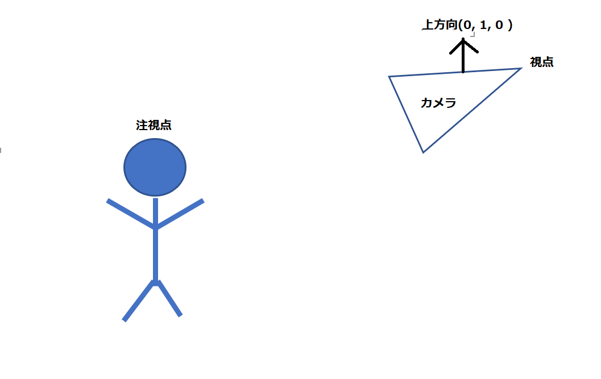
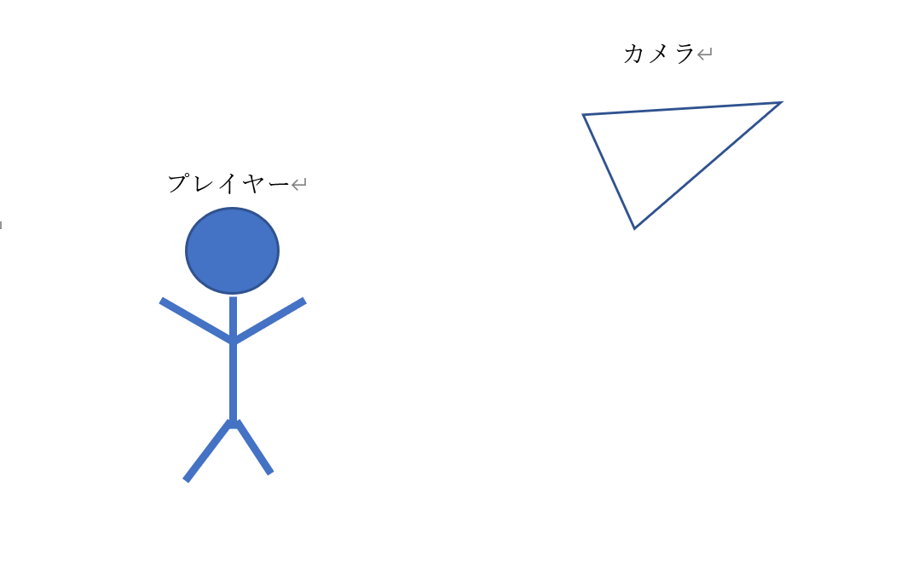
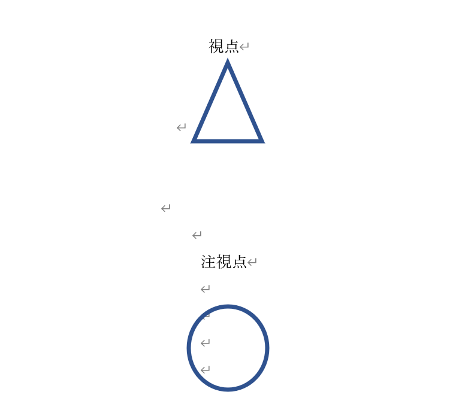
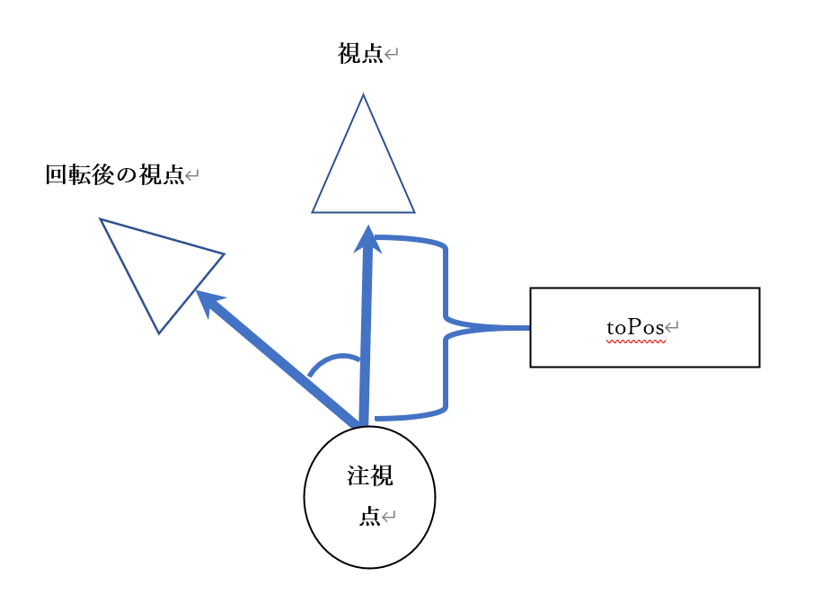
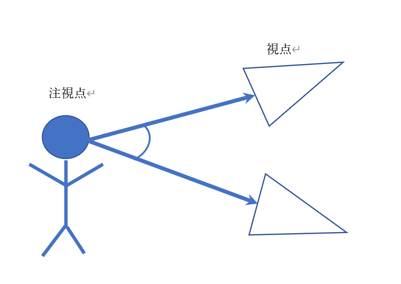
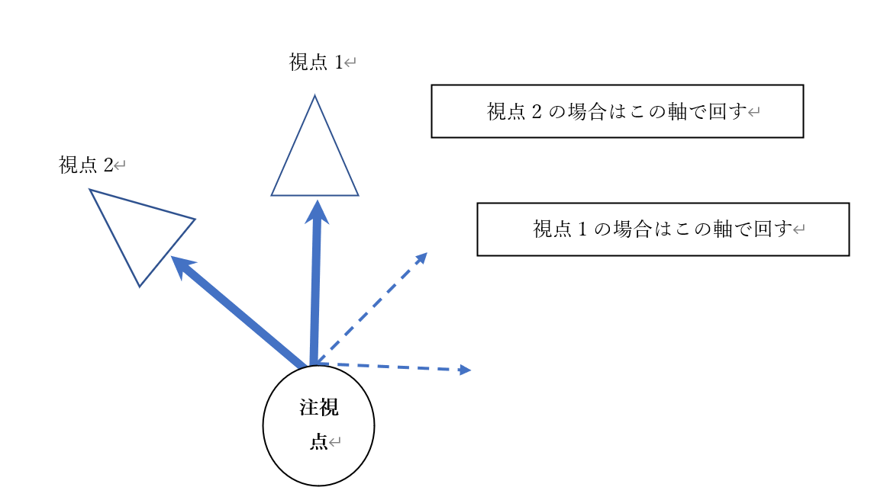
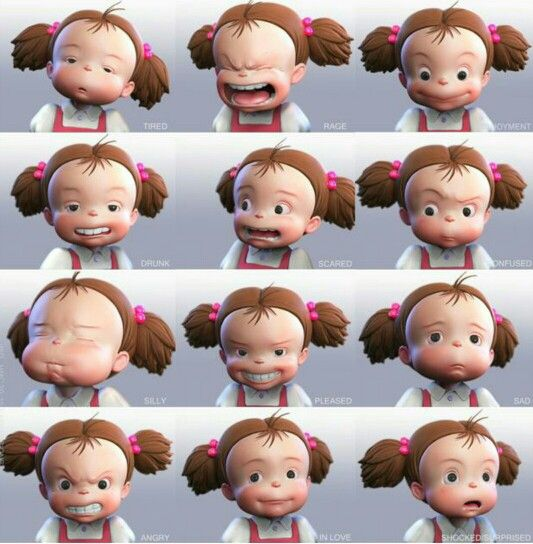
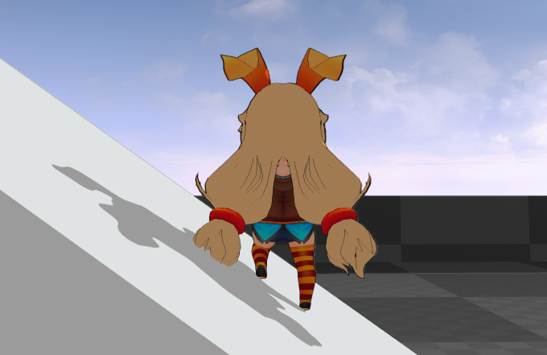
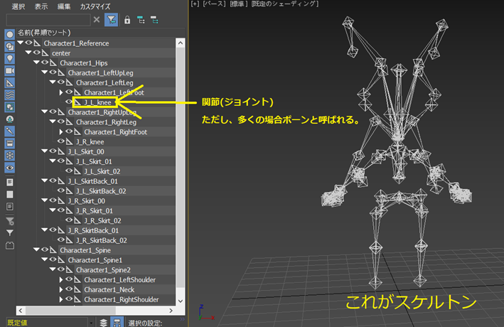

<!-- @import "[TOC]" {cmd="toc" depthFrom=1 depthTo=6 orderedList=false} -->


<!-- 改ページ. -->
<div style="page-break-before:always"></div>

# 定数バッファ課題
## 課題-1
`Kadai_03_01/Kdai_03_01.sln`を立ち上げて、次の課題を行いなさい。
「回転行列をGPUに送って三角形をZ軸周りに0.5(ラジアン単位)回す。」

## 課題-2
`Kadai_03_02/Kdai_03_02.sln`を立ち上げて、次の課題を行いなさい。
「X軸方向に3倍、Y軸方向に1.5倍、Z軸方向に1倍の拡大行列をGPUに送って三角形を拡大する。」

## 課題-3
`Kadai_03_03/Kdai_03_03.sln`を立ち上げて、次の課題を行いなさい。
「三角形のカラーをGPUに送って、三角形を緑色にしなさい。」

## 課題-4（ハンズオン）
`Kadai_03_04/Kdai_03_04.sln`を立ち上げて、次の課題を行いなさい。
### コントローラーの入力で三角形を左右に動かす。
step-1～step-8のプログラムを入力して下さい。
#### step-1 平行移動行列を送るための定数バッファを作成。
[`main.cpp`]
```cpp
//step-1 平行移動行列を送るための定数バッファを作成。
ConstantBuffer cb;
//行列は64バイトなので定数バッファのサイズに16を指定する。
cb.Init(64);
```

#### step-2 定数バッファをディスクリプタヒープに登録。
[`main.cpp`]
```cpp
//step-2 定数バッファをディスクリプタヒープに登録。
ds.RegistConstantBuffer(0, cb);
```

#### step-3 三角形の座標を表す変数を定義する。
[`main.cpp`]
```cpp
//step-3 三角形の座標を表す変数を定義する。
Vector3 trianglePos;
trianglePos.x = 0.0f;
trianglePos.y = 0.0f;
trianglePos.z = 0.0f;
```

#### step-4 コントローラーの入力で三角形を動かす。
[`main.cpp`]
```cpp
//step-4 コントローラーの入力で三角形を動かす。
if (g_pad[0]->IsPress(enButtonRight))
{
    trianglePos.x += 0.01f;
}
if (g_pad[0]->IsPress(enButtonLeft))
{
    trianglePos.x -= 0.01f;
}
```

#### step-5 三角形の座標を使って平行移動行列を作成する。
[`main.cpp`]
```cpp
//step-5 三角形の座標を使って平行移動行列を作成する。
Matrix mTrans;
mTrans.MakeTranslation(trianglePos);
```

#### step-6 定数バッファに平行移動行列をコピーする。
[`main.cpp`]
```cpp
//step-6 定数バッファに平行移動行列をコピーする。
cb.CopyToVRAM(mTrans);
```

#### step-7 レジスタb0のデータにアクセスするための変数を定義する。
[`Assets/shader/sample.fx`]
```cpp
//step-7 レジスタb0のデータにアクセスするための変数を定義する。
cbuffer cb : register( b0 ){
	float4x4 g_transMatrix;
};

```
#### step-8 平行移動行列と座標を乗算して座標変換を行う。
[`Assets/shader/sample.fx`]
```cpp
//step-8 平行移動行列と座標を乗算して座標変換を行う。
vsOut.pos = mul( g_transMatrix, In.pos );
```

## 課題-5
`Kadai_03_05/Kdai_03_05.sln`を立ち上げて、次の課題を行いなさい.
「三角形をコントローラーの左右の入力でZ軸周りに回転させなさい。」

## 課題-6
`Kadai_03_06/Kdai_03_06.sln`を立ち上げて、次の課題を行いなさい.
「三角形をコントローラーの左右の入力でX軸方向に拡大させなさい。」

## 課題-7
`Kadai_03_07/Kdai_03_07`を立ち上げて、次の仕様を実装しなさい。
1. 三角形をコントローラーの左右の入力で左右に移動する。
2. かつ、コントローラーのAボタンの入力でY軸周りに回転する。
3. かつ、コントローラーのBボタンの入力でY軸方向に拡大する。

<!-- 改ページ. -->
<div style="page-break-before:always"></div>


<!-- 改ページ. -->
<div style="page-break-before:always"></div>

# テクスチャマッピング課題
## 課題-8
Kadai_03_08を改造して、次の図のように三角形にテクスチャを貼り付けなさい。

</br>

プログラム中の次のコメントを参考にして実装しなさい。

1. step-1 三角形ポリゴンにUV座標を設定。(main.cpp)
2. step-2 Assets/image/sample_00.ddsをロードしてテクスチャを作成。(main.cpp)
3. step-3 テクスチャをディスクリプタヒープに登録。(main.cpp)
4. step-4 t0レジスタに設定されているテクスチャにアクセスするための変数を追加する。(sample.fx)
5. step-5 テクスチャカラーをサンプリングして返す。(sample.fx)


## 課題-9
Kadai_03_09を改造して、次の図のように三角形にテクスチャを貼り付けなさい。

</br>

プログラム中の次のコメントを参考にして実装しなさい。内容はほとんど実習課題-8と同じですがテクスチャの貼られ方が違います。実習課題-8との違いは三角形の頂点UV座標です。

1. step-1 三角形ポリゴンにUV座標を設定。(UV座標の値が演習課題_1と違う)
2. step-2 Assets/image/sample_00.ddsをロードしてテクスチャを作成。(演習課題_1と同じ)
3. step-3 テクスチャをディスクリプタヒープに登録。(演習課題_1と同じ)
4. step-4 t0レジスタに設定されているテクスチャにアクセスするための変数を追加する。(演習課題_1と同じ)
5. step-5 テクスチャカラーをサンプリングして返す。(演習課題_1と同じ)

## 課題-10

Kadai_03_10を改造して、次の動画のような処理を実装しなさい。

`Kadai_03_10/movie.wmv`

<!-- 改ページ. -->
<div style="page-break-before:always"></div>
[3Dモデル表示]</br>


# Optional 1 3Dモデル表示
## Opt 1.1 概要
&emsp;Chapter2,3で単純な三角形ポリゴン表示について見てきました。単純な三角形ポリゴンを表示するためには、次の３つの情報が必要でした。</br>

1. 頂点バッファ
2. インデックスバッファ
3. テクスチャ(マテリアル情報)

&emsp;実は複雑な3Dモデルの表示というのも、この三角形ポリゴン表示の知識で行うことができます。ようは複雑な3Dモデルというのは、三角形ポリゴンがたくさんあるだけです。本書では、これ以降独自のモデルフォーマットのtkmファイルというものを利用してモデル表示が行えるModelクラスを利用して話を進めていきます。</br>

## Opt 1.2 Modelクラス
Modelクラスは下記のような機能を提供するクラスです。
1. tkmファイルをロードして、モデル表示に必要な頂点バッファ、インデックスバッファ、テクスチャを初期化する。
2. ワールド行列の計算
3. 3Dモデルを表示する機能


&emsp;これをプログラムで記述すると下記のような感じになります。</br>

```cpp
//マテリアルの数が３個の場合。
struct SMesh {
	SVertexBuffer	vertexBuffer;		//頂点バッファ。
	SMaterial 		materials[3];		//マテリアルの配列。
	SIndexBuffer 	indexBuffer[3];		//インデックスバッファの配列。マテリアルの数分だけインデックスバッファはあるよ。
};
```
&emsp;頂点バッファ、インデックスバッファ、マテリアル情報が入っているデータです。3Dモデルデータはパーツによってメッシュが分割されていることがあります（人型モデルであれば、髪の毛と体といった感じで分かれている場合があります）。なので、各メッシュごとに頂点バッファ、インデックスバッファ、マテリアル情報のデータを保持しています。</br>

&emsp;本書のサンプルプログラムでtkmファイルをロードする処理はMiniEngine/tkFile/TkmFile.h、TkmFile.cppに記載されています。tkmファイルをロードすることができたら、このデータを元にDirectX12のAPIを利用して、頂点バッファ、インデックスバッファ、テクスチャをグラフィックメモリ上に作成していきます。この処理を行っているのがMeshPartsクラスとなります。この処理はChapter2,3で勉強してきた内容となります。簡単にだけこれらを行っているソースの箇所を紹介します。</br>

[MiniEngine/MeshParts.cpp(83行目)]
```cpp
void MeshParts::CreateMeshFromTkmMesh(
	const TkmFile::SMesh& tkmMesh, 
	int meshNo,
	const wchar_t* fxFilePath,
	const char* vsEntryPointFunc,
	const char* psEntryPointFunc)
{
	 ・
	 ・
	 ・
	省略
	 ・
	 ・
 	 ・	
}
```
&emsp;コードの詳細は気にしなくて構いませんので、この関数内の次の３つのコメントに注目してください。

1. 頂点バッファを作成(90行目)
2. インデックスバッファを作成(108行目)
3. マテリアルを作成(137行目)

&emsp;このように、難しいことをやっているように見えますが、本質的には三角形を描画するときと同等のことを行っています。</br>
&emsp;各種データを作成することができたら、後は毎フレーム、ドローコールを実行するだけです。これもChapter2,3で見てきた内容となります。これも簡単にだけソースの箇所を紹介しておきます。</br>
[MiniEngine/MeshParts.cpp(159行目)]
```cpp
void MeshParts::Draw(
	RenderContext& rc,
	const Matrix& mWorld,
	const Matrix& mView,
	const Matrix& mProj
)
{
	 ・
	 ・
	 ・
	省略
	 ・
	 ・
	 ・
}
```
&emsp;こちらもコードの詳細は気にしなくて構いません。次の４つのコメントに注目してください。

1. 頂点バッファを設定。(187行目)
2. ディスクリプタヒープを登録。(193行目)
3. インデックスバッファを設定。(195行目)
4. ドローコールを実行。(199行目)

&emsp;このように、毎フレームの描画処理も本質的にはポリゴンを表示する処理と全く同じことをしているだけとなります。</br>
&emsp;本書ではモデル表示処理の詳細は説明はしませんが、処理を追いかけてみると基礎的な知識の理解が深まると思います。最後に、本書のモデル表示関連のクラス図を記載しておきます。</br>

## 【ハンズオン】3Dモデルを表示する処理を記述する。
では、本書が提供しているModelクラスを利用して、3Dモデルを表示する処理を実装してみましょう。Optional_01_01/Optional_01_01.slnを立ち上げて、step-1～step-7のプログラムを入力してください。
### step-1 3Dモデルをロードする。
[main.cpp]</br>
```cpp
//ロードするための初期化情報を作成。
ModelInitData initData;
//tkmファイルのファイルパス。
initData.m_tkmFilePath = "Assets/modelData/unityChan.tkm";
//使用するシェーダーのファイルパス。
initData.m_fxFilePath = "Assets/shader/NoAnimModel_Texture.fx";
//作成した初期化情報を使って、初期化する。
Model charaModel;
charaModel.Init(initData);
```
#### step-2 3Dモデルをドローする。
[main.cpp]</br>
```cpp
//step-2 3Dモデルをドローする。
charaModel.Draw(renderContext);
```

### step-4 コントローラーの入力でキャラを動かす。
[main.cpp]</br>
```cpp
pos.x += g_pad[0]->GetLStickXF();
```

### step-5 コントローラーの入力でキャラをY軸周りに回転させる。
[main.cpp]</br>
```cpp
//step-5 コントローラーの入力でキャラをY軸周りに回転させる。
Quaternion addRot;
addRot.SetRotationY(g_pad[0]->GetRStickXF() * 0.01f );
//クォータニオンは掛け算で回転を合成できる。
rot *= addRot ;
```

### step-6 コントローラーの入力でキャラをX軸方向に拡大させる。
[main.cpp]</br>
```cpp
//step-6 コントローラーの入力でキャラをX軸方向に拡大させる。
if (g_pad[0]->IsPress(enButtonLeft)) {
	scale.x += 0.01f;
}
if (g_pad[0]->IsPress(enButtonRight)) {
	scale.x -= 0.01f;
}
```

### step-7 平行移動、回転、拡大率を利用してワールド行列を計算する。
[main.cpp]</br>
```cpp
//step-7 平行移動、回転、拡大率を利用してワールド行列を計算する。
charaModel.UpdateWorldMatrix(pos, rot, scale);
```


<!-- 改ページ. -->
<div style="page-break-before:always"></div>


# Optional 2 カメラの基礎

3Dゲームにはキャラクターを映しているカメラという概念があります。カメラ行列はワールド座標系の点をカメラ座標系に変換するための行列です。射影変換行列はカメラ座標系の点をス正規化クリーン座標系に変換する行列です。3Dモデルは最終的にすべてに頂点に対して、下記の３つの座標変換を行うことで画面に表示されます。</br>
1. モデル座標系の頂点にワールド行列を乗算してワールド座標系に変換
2. ワールド座標系の頂点にカメラ行列を乗算してカメラ座標系に変換
3. カメラ座標系の頂点に射影変換行列を乗算して正規化スクリーン空間に変換

## Optional 2.1 カメラ行列
カメラ行列は、ワールド空間の点をカメラ座標系に変換する行列です。カメラ座標系というのはカメラを原点、カメラの上方向をY軸、前方向をZ軸、左方向をX軸とする空間です(図Opt2.1)。</br>
**図Opt2.1**</br>
</img></br>

ワールド座標系の点にカメラ行列を乗算することで、カメラ座標系に変換することができます。</br>

### Optional 2.1.1 注視点、視点、カメラの上方向
カメラ行列を作成するためには、カメラの注視点、視点、上方向を決める必要があります。注視点はカメラが移しているターゲットとなる座標、視点はカメラの位置となります(図Opt2.2)。</br>
**図Opt2.2**</br>
</img></br>
カメラの上方向は、カメラの前方向と左方向の外積で求めることができるのですが、多くのゲームでは3次元ベクトルでY方向を表す( 0, 1, 0 )を指定すればＯＫです。ただし、フライトシミュレーションのような、360度カメラが旋回するゲームを作成している場合は上記の外積を利用して、正確に求める必要がありますので、そこは覚えておいてください。

### Optional 2.1.2 カメラ行列を作成する関数

本書で提供しているミニエンジンには行列を扱うことができるクラスのMatrixクラスが用意されています。このクラスには、'MakeLookAtLH()'というメンバ関数があります。この関数の引数に視点、注視点、カメラの上方向を渡すことで、カメラ行列を作成することができます。次の疑似コードはゲームのプレイヤーキャラクターを注視するカメラ行列を計算しているコードです。</br>
```cpp
//カメラの注視点を計算する。
Vector3 cameraTarget = player.position;
cameraTarget.y += 50.0f; //プレイヤーのちょっと上を注視する。

//カメラの視点を計算する。
//カメラの位置を注視点からY方向に+100、Z方向に+100にすることで、
//見下ろしている視点のカメラにすることができる。
Vector3 cameraPosition;
cameraPosition.x = cameraTarget.x;
cameraPosition.y = cameraTarget.y + 100.0f;
cameraPosition.z = cameraTarget.z + 100.0f;

//カメラの上方向を決定する。
Vector3 cameraUp;
cameraUp.x = 0.0f;
cameraUp.y = 1.0f;
cameraUp.z = 0.0f;

//カメラ行列を計算する。
Matrix cameraMatrix;
cameraMatrix.MakeLookAt( 
	cameraPosition,		//視点。
	cameraTarget, 		//注視点。
	cameraUp 			//上方向。
);
```
### Optional 2.1.3 【ハンズオン】カメラを動かしてみよう。
では、カメラの注視点を動かすプログラムを実装してみましょう。Option_02_01/Option_02_01.slnを立ち上げてください。

#### step-1 キー入力でカメラの注視点を左右に動かす。
では、キー入力でカメラの注視点を左右に動かしてみましょう。main.cppを開いてリストopt2.1を入力してください。入力出来たら実行して注視点が動いていることを確認してください。</br>
[リストopt2.1 main.cpp]
```cpp
//step-1 キー入力で注視点を左右に動かす。
Vector3 moveTarget;
if (g_pad[0]->IsPress(enButtonLeft)) {
	//
	moveTarget.x = 1.0f;
}
if (g_pad[0]->IsPress(enButtonRight)) {
	moveTarget.x = -1.0f;
}
//注視点を動かす。
g_camera3D->MoveTarget(moveTarget);
```

#### step-2 キー入力でカメラの注視点を左右に動かす。
では、続いてカメラの視点を左右に動かしてみましょう。main.cppを開いてリストOpt2.2を入力してください。入力出来たら実行して視点が動いていることを確認してください。</br>
[リストopt2.2 main.cpp]
```cpp
//step-2 キー入力で視点を左右に動かす。
Vector3 movePosition;
if (g_pad[0]->IsPress(enButtonUp)) {
	movePosition.x = 1.0f;
}
if (g_pad[0]->IsPress(enButtonDown)) {
	movePosition.x = -1.0f;
}
//視点を動かす。
g_camera3D->MovePosition(movePosition);
```

#### カメラは行列を計算しているのはどこ？
さて、先ほどのサンプルプログラムは一体どこでカメラ行列を計算しているのでしょうか？答えはCameraクラスです。MiniEngine/Camera.cppの28行目を開くと次のようなプログラムが記載されています。
```cpp
//ビュー行列の算出
m_viewMatrix.MakeLookAt( m_position, m_target, m_up );
```
ビュー行列の計算はCamera::Update()関数の中に記述されています。この関数は毎フレーム実行されている関数です。

#### ワールド座標系の頂点にカメラ行列を乗算してカメラ座標系に変換しているのはどこ？
続いて、先ほどのサンプルでワールド座標系の頂点座標をカメラ座標系に変換してるプログラムはどこに記述されているのでしょうか？答えは頂点シェーダーです。Assets/shader/sample.fxの57行目を開くと次のようなプログラムが記載されています。
```cpp
psIn.pos = mul(mView, psIn.pos);	//ワールド座標系からカメラ座標系に変換。
```
カメラを動かすプログラムを作成する場合は、必ずワールド座標系の頂点を、カメラ座標系に変換する必要があります。試しに、この一行をコメントアウトしてみてください。表示がおかしくなるはずです。

<!-- 改ページ. -->
<div style="page-break-before:always"></div>

## 評価テスト-10
次の評価テストを行いなさい。</br>
[評価テストへジャンプ](https://docs.google.com/forms/d/e/1FAIpQLSfYLYJZnc013fkJc_oiNlD7WznekAalc42A5YzXyT08Xf3KPQ/viewform?usp=sf_link)
<!-- 改ページ. -->
<div style="page-break-before:always"></div>

## Optional 2.2 三人称カメラ
このチャプターでは見下ろし型の三人称カメラの実装方法について見ていきます。三人称視点のカメラとは図Opt2.3のようなカメラのことをいいます。</br>
**図opt2.3**</br>
</img></br>

### Optional 2.2.1 プレイヤーを追従
三人称カメラでは、カメラがプレイヤーを追従する必要があります。カメラを追従させるには、カメラの注視点と視点を動かす必要があります。多くの三人称カメラのゲームではプレイヤーが操作するキャラクターの座標を基準にして、注視点を決めます。そして、視点は注視点からの距離を保つように決定することによって、プレイヤーを追従するカメラが出来上がります。次に疑似コードを記載します。
```cpp
//カメラの注視点から視点に向かうベクトルを計算する。
Vector3 toCameraPos = g_camera->m_position – g_camera->m_target;
//新しい注視点を計算する。注視点はプレイヤーのちょっと上を見る。
g_camera->m_target = g_player->m_position;
g_camera->m_target.y += 2.0f;
//新しい注視点から距離を保つように、新しい視点を計算する。
g_camera->m_position = g_camera->m_target + toCameraPos;
```

### Optional 2.2.2【ハンズオン】プレイヤーを追従するカメラ

では、プレイヤーを追従するカメラを実装してみましょう。Optional_02_02/Optional_02_02.slnを立ち上げて、main.cppの52行目にリストOpt2.3を入力してください。</br>
[リストOpt2.3]
```cpp
//【ハンズオン】プレイヤーを追従するカメラ
//現在のカメラの視点を取得する。
Vector3 cameraPos = g_camera3D->GetPosition();
//現在のカメラのターゲットを取得する。
Vector3 cameraTarget = g_camera3D->GetTarget();
//視点から注視点に向かって伸びるベクトルを計算する。
Vector3 toCameraPos = cameraPos - cameraTarget;
//新しい注視点をティーポットの少し上に設定する。
cameraTarget = teapotPos;
cameraTarget.y = 50.0f;
//新しい視点を、「新しい注視点　＋　toCameraPos」で求める。
cameraPos = cameraTarget + toCameraPos;

//新しい視点と注視点をカメラに設定する。
g_camera3D->SetPosition(cameraPos);
g_camera3D->SetTarget(cameraTarget);
```

### Optional 2.2.3 カメラの回転
続いて、三人称カメラの回転のさせ方を学んでいきましょう。
#### Y軸周りの回転
では、まずカメラをY軸周りに回転させる方法を見てみましょう。図Opt2.4はキャラクターとカメラを真上から見た図になります。</br>
**図Opt2.4**</br>
</img></br>
カメラがY軸周りに回るということは、カメラの視点が注視点を中心にして回転することを意味しています(図Opt2.5)。</br>

**図Opt2.5**</br>
</img></br>

視点を回転させるには、注視点から視点に向かって伸びるベクトルを回転させて、視点を計算してやればいいのです。注視点から視点に向かうベクトルは次のプログラムで求めることができます。
```cpp
//注視点をtarget、視点をposとして、注視点から視点に向かうベクトルをtoPosとすると、
Vector3 toPos = g_camera->m_position – g_camera->m_target;
```
このベクトル、toPosをY軸周りに10度回転させるには、Y軸周りに10度回転する行列を使って、ベクトルと乗算してやればいいことになります。
```cpp
//Y軸周りに10度回転するクォータニオンを計算する。
Quaternion qRot;
qRot.SetRotationDegY(10.0f);
//クォータニオンを使って、toPosを回転させる。
qRot.Apply( toPos );
```
そして、toPosを回転させることができたら、このベクトルと注視点を加算したものを視点とすればいいのです。
```cpp
g_camera->m_position = g_camera->m_target + toPos;
```

### Optional 2.2.4【ハンズオン】コントローラーの入力でY軸周りに回転するカメラを作成する。
では、コントローラーの入力でY軸周りに回転するカメラを実装しましょう。Optional_02_03/Optional_02_03.slnを立ち上げて、main.cppの59行目にリストOpt2.4を入力してください。</br>

[リストOpt2.4 main.cpp]
```cpp
//【ハンズオン】コントローラーの入力でY軸周りに回転するカメラを作成する。
Quaternion qRotY;
//g_pad[0]->GetRStickXF()はコントローラーの右スティックの入力量が取得できる関数。
qRotY.SetRotationY(g_pad[0]->GetRStickXF() * 0.005f);
//回転クォータニオンでtoCameraPosを回す。
qRotY.Apply(toCameraPos);
```

### Optional 2.2.5 X軸周りの回転
続いて、カメラのX軸周りの回転を見ていきましょう。ここでいうX軸周りの回転とは図Opt2.6の回転を指します。</br>
**図Opt2.6**</br>
</img></br>
この回転も注視点から視点に向かうベクトルを回転させることに変わりはありません。先ほどと違う点は、回転させる軸の求め方です。先程はY軸周り固定でしたが、今回はカメラのY軸周りの回転を考慮して、回転軸を計算する必要があります。図Opt2.7を見てみてください。</br>

**図Opt2.7**</br>
</img></br>
このように回す軸が変わることになります。この回転軸を求めるためには外積を活用します。外積は次のようなプログラムで求めることができます。</br>

```cpp
//ベクトルv0、v1の外積の結果をv2とすると
v2.x = v0.y×v1.z － v0.z×v1.y
v2.y = v0.z×v1.x － v0.x×v1.z
v2.z = v0.x×v1.y － v0.y×v1.x
```

ゲームでよく使われる、外積の特性に「外積の結果は二つのベクトルの直行するベクトルになる」というものがあります。直行とはなす角が90度で交わるということです。この性質を使うことで、視点を回転させるベクトルが計算できます。</br>

まず、注視点から視点に向かうベクトルを計算します。そしてそのベクトルと上方向のベクトルと外積を計算します。この結果が先ほど見た図の回転軸になるのです。</br>
```cpp
//注視点をtarget、視点をposとして、注視点から視点に向かうベクトルをtoPosとすると、
Vector3 toPos = g_camera3D->m_position – g_camera3D->m_target;
Vector3 vUP( 0.0f, 1.0f, 0.0f );
//外積を計算して、回転軸を求める。
Vector3 vRotAxis;
//外積を求める。
vRotAxis.Cross(toPos, vUP);
//大きさ1にするために正規化を行う。
vRotAxis.Normalize();
```

あとは、この軸周りに回転する行列を作成して、toPosを回転すればいいのです。

```cpp
Quaternion qRot;
//任意の軸周りの回転行列を作成。
qRot.SetRotationDeg( vRotAxis, 10.0f); 
//ベクトルを回転させる。
qRot.Apply( toPos )
//最後にtoPosとtargetから視点を計算する。
g_camera3D->m_position = g_camera3D->m_target + toPos;
```

### Optional 2.2.6【ハンズオン】コントローラーの入力でX軸周りに回転するカメラを作成する。
では、X軸周りんい回転するカメラを作成しましょう。Option_02_04/Option_02_04.slnを立ち上げて、main.cppの66行目にリストOpt2.5のプログラムを入力してください。</br>

```cpp
//【ハンズオン】コントローラーの入力でX軸周りに回転するカメラを作成する。
Vector3 rotAxis;
rotAxis.Cross(g_vec3AxisY, toCameraPos);
rotAxis.Normalize();
Quaternion qRotX;
qRotX.SetRotation(rotAxis, g_pad[0]->GetRStickYF() * 0.005f);
qRotX.Apply(toCameraPos);
```
<!-- 改ページ. -->
<div style="page-break-before:always"></div>

## 評価テスト-11
[評価テストへジャンプ](https://docs.google.com/forms/d/e/1FAIpQLSdvfY9LYtR4m4JQ1thQm4KYLLnFhLFt-g2mOeDh_7UMkBDmtg/viewform?usp=sf_link)

<!-- 改ページ. -->
<div style="page-break-before:always"></div>

## Optional 2.3 カメラを考慮したキャラクターの移動
カメラを回転させることができるようになると、次は「カメラを考慮したキャラクターの移動」を行いたくなります。これまでは、前後に進みたい場合はキャラクターのZ座標に＋－、左右に進みたい場合はX座標に＋－していましたが、カメラが動くとそうはいきません。なぜなら、キャラクターの前後への移動がZ座標とは限らないからです。では、カメラを考慮してキャラクターを移動させる方法を見ていきましょう。

### Optional 2.3.1 カメラの方向に移動させる
カメラを考慮して、前後に動かすには、カメラの前方向を使って、移動させればよいのです。カメラの前方向を求めるためには、まずは視点から注視点に向かって伸びるベクトルVを計算します。</br>
**V = 注視点　―　視点**</br>
このベクトルVを正規化して大きさ１にしてやることで、前方向を表すベクトルになります。</br>
**カメラの前方向 = normalize( V )**</br>
プログラムにすると下記のようになります。</br>
```cpp
//視点から注視点に向かって伸びるベクトルを求める。
Vector3 v = camera.m_target – camera.position;
//vを正規化して、大きさ１のベクトルにする。  
v.Normalize();　
```
これでカメラの方向が求まりました。キャラクターをカメラの奥方向に動かしたい場合は、このベクトルを使って、下記のようなコードを書けばいいことになります。
```cpp
//カメラの方向に速度5.0で移動する。
player.position += v * 5.0f;
```

### Optional 2.3.2 【ハンズオン】ティーポットをカメラの前方向に動かす。
では、カメラの前方向を考慮した移動処理を実装してみましょう。Option_02_05/Option_02_05.slnを立ち上げてください。

#### step-1 カメラの前ベクトルを求める。
まずはカメラの視点と注視点から、カメラの前ベクトルを求めましょう。main.cppの51行目にOpt2.5のプログラムを入力してください。</br>
[Opt2.5 main.cpp]
```cpp
//step-1 カメラの前ベクトルを求める。
//視点から注視点に向かって伸びるベクトルVを求める。
Vector3 v = g_camera3D->GetTarget() - g_camera3D->GetPosition();
//ベクトルVを正規化して、カメラの前方向にする。
v.Normalize();
```

### step-2 カメラの前方向を使って、ティーポットの座標を動かす。
続いて、カメラの前方向を使って、ティーポットの座標を動かします。Opt2.6のプログラムを入力してください。</br>
[Opt2.6 main.cpp]
```cpp
//step-2 カメラの前方向を使って、ティーポットの座標を動かす。
//カメラの前方向を使って、ティーポットの座標を動かす。
if (g_pad[0]->IsPress(enButtonUp)) {
	//上ボタンが押されたときは奥に向かって移動する。
	teapotPos += v * 2.0f;
}else if (g_pad[0]->IsPress(enButtonDown)) {
	//下ボタンが押されたときは手前に向かって移動する。
	teapotPos -= v * 2.0f;
}
```
### step-3 ティーポットのワールド行列を更新する。
座標を動かしただけではモデルは動きません。ModelクラスのUpdateWorldMatrix()を呼び出して、ワールド行列を更新する必要があります。Opt2.7のぷ宇グラムを入力してください。入力出来たら実行してください。コントローラの上下キー(キーボードなら8,2)でティーポットを移動させることができます。</br>
[Opt2.7 main.cpp]
```cpp
//step-3 ティーポットのワールド行列を更新する。
//ModelクラスのUpdateWorldMatrix関数を呼び出して、ティーポットのワールド行列を更新する。
model.UpdateWorldMatrix(
	teapotPos,			//第一引数は座標。
	g_quatIdentity,		//第二引数は回転クォータニオン。g_quatIdentityは単位クォータニオン。(回転なし)
	g_vec3One			//第三引数は拡大率。g_vec3Oneは1,1,1のベクトル。等倍。
);
```
### Optional 2.3.3 XZ平面での移動
さて、うまくいったでしょうか？　12.8のハンズオンだけでは、カメラの向きによってキャラクターが宙に浮かんでしまったり、地面にめり込んでしまったりしてしまったはずです。例えばユーザーがコントローラーの上方向を入力して、カメラを考慮した移動を行いたい場合、多くの場合でY軸方向の移動は不要で、XZ平面での移動を期待しています。XZ平面での移動を行うためには、カメラのXZ平面での前方向を求めれば良いことになります。次に疑似コードを示します。</br>
```cpp
Vector3 v = camera.m_target – camera.position;  //視点から注視点に向かって伸びるベクトルを求める。
v.y = 0.0f;      //y成分を打ち消して、XZ平面でのベクトルにする。
v.Normalize();　//vを正規化して、大きさ１のベクトルにする。
```

vのY成分を0にすることで、vはXZ平面上のベクトルになりました。あとは、このベクトルを使ってキャラクターを移動させてやればいいのです。

### Optional 2.3.4 【課題】ティーポットをカメラのXZ平面での前方向に動かす。(時間 10分)
Optional_02_05を改造して、ティーポットをカメラのXZ平面での前方向に動かせるように改造しなさい。


### Optional 2.3.5 カメラを考慮した左右の移動
続いて、カメラを考慮した左右の移動を行う方法を見ていきましょう。前後に移動する場合は、カメラの進行方向(前ベクトル)を求めました。つまり左右の移動は、カメラの横ベクトルを求めればよいのです。このベクトルを求めるには外積の性質の「二つのベクトルの外積は、その二つのベクトルに直行するベクトルである」という性質を利用します。では、横ベクトルを求めるコードを見てみましょう。
```cpp
//まずカメラの前方向を求める。
Vector3 cameraForward = camera.m_target – camera.m_position;
cameraForward.y = 0.0f;
cameraForward.Normalize();

//続いてカメラの横ベクトルを求める。
Vector3 up = {0.0f, 1.0f, 0.0f};
Vector3 cameraRight;
cameraRight.Cross( up, cameraForward ); //カメラの前ベクトルと上ベクトルとで外積を求める。
cameraRight.Normalize();  //正規化する。
```
これで、カメラの横ベクトルが求まりました。あとは、このベクトルを使って、キャラクターを動かしてやればよいのです。
```cpp
player.m_position += cameraRight * 5.0f;   //カメラの横方向に速度5.0で移動する。
```
### Optional_2.3.6 【ハンズオン】ティーポットをカメラの左右方向に動かす。
では、カメラを左右に動かすプログラムを実装していきましょう。Optional_02_06/Optional_02_06.slnを立ち上げてください。

#### step-1 カメラの横ベクトルを求める。
では、まず外積を利用してカメラの横ベクトルを求めるプログラムを実装しましょう。main.cppの59行目にOpt2.8のプログラムを入力してください。</br>
[Opt2.8 main.cpp]
```cpp
//step-1 カメラの横ベクトルを求める。
Vector3 cameraYoko;
//カメラの前方向と上方向の外積を求める。
cameraYoko.Cross( g_vec3Up, v );
//正規化する。
cameraYoko.Normalize();
```
#### step-2 カメラの横ベクトルを使ってティーポットの座標を動かす。
横ベクトルが求まったら、あとはそれを利用して、ティーポットを動かします。main.cppにOpt2.9のプログラムを入力してください。入力出来たら実行してください。コントローラーの左右(キーボードなら4,6)でカメラを考慮してティーポットを動かすことができます。</br>
[Opt2.9 main.cpp]
```cpp
//step-2 カメラの横ベクトルを使って、ティーポットの座標を動かす。
if (g_pad[0]->IsPress(enButtonRight)) {
	//右ボタンが押されたときは右に移動する。
	teapotPos += cameraYoko * 2.0f;
}else if (g_pad[0]->IsPress(enButtonLeft)) {
	//左ボタンが押されたときは左に移動する。
	teapotPos -= cameraYoko * 2.0f;
}
```
### Optional 2.3.6 アナログスティックを利用したキャラクターの移動
3Dゲームでは十字キーを利用した移動処理ではなく、アナログスティックを利用した移動処理が行われることがほとんどです。この理由としては、３Ｄゲームではアナログスティックを利用した移動の方がユーザーの操作性がますからです。ほとんどのアナログスティックを扱うことができるプログラムでは、アナログスティックが倒されている量というものを取得することができます。本書が提供しているエンジンのパッドを扱うPadクラスは、アナログスティックが倒されている量を－１～１の範囲で取得することができます。</br>
Padクラスには下記の関数があります。</br>
1. GetLStickXF() : 左スティックが倒された量を取得する(X軸方向)
2. GetLStickXY() : 左スティックが倒された量を取得する(Y軸方向)
3. GetRStickXF() : 右スティックが倒された量を取得する(X軸方向)
4. GetRStickYF() : 右スティックが倒された量を取得する(Y軸方向)

これらの関数はアナログスティックはX軸方向に倒されている量と、Y軸方向に倒されている量を取得することができます。キャラクターの左右の移動はX軸方向に倒されている量、前後の移動はY軸方向に倒されている量に応じて移動させることでアナログスティックを利用した移動を行うことができます。次に疑似コードを示します。
```cpp
//カメラのXZ平面での前はcameraForward、横はcameraYokoで求まっている。
//まずは左右の移動。
playerPos += cameraYoko * 2.0f * g_pad[0]->GetLStickXF(); 
//続いて前後の移動。
playerPos += cameraYoko * 2.0f * g_pad[0]->GetLStickYF(); 
```

### Optional 2.3.7 【ハンズオン】アナログスティックを利用した移動処理を実装する。
では、`Optional_02_07/Optional_02_07.sln`を改造して、アナログスティックを使った移動処理を実装してみましょう。main.cppを開いて66行目にOpt2.10のプログラムを入力してください。入力出来たらコントローラーの左スティック(キーボードならWASD)を入力して動作を確認してください。</br>
[Opt2.10 main.cpp]
```cpp
//【ハンズオン】アナログスティックを利用した移動処理を実装する。
teapotPos += cameraRight * 2.0f * g_pad[0]->GetLStickXF();
teapotPos += cameraForward * 2.0f * g_pad[0]->GetLStickYF();
```


<!-- 改ページ. -->
<div style="page-break-before:always"></div>

## 評価テスト-12
[評価テストへジャンプ](https://docs.google.com/forms/d/e/1FAIpQLSfTIBru_eUVsbnEMc_7FgXJ7JvykbR9k3kzEapEXfjblCYwzQ/viewform?usp=sf_link)

<!-- 改ページ. -->
<div style="page-break-before:always"></div>

# Optional 3 アニメーションの基礎
ここで、３Ｄモデルのアニメーションに関する基礎を学んでいきます。現在の３Ｄゲームで利用されているアニメーションシステムは大きく分けて３つに分類することができます。
1. モーフィング
2. プロシージャルアニメーション
3. スケルトンアニメーション
ここでは、主に３番のスケルトンアニメーションについて学んでいくことになるのですが、簡単に１と２についても説明していきます。

## Optional 3.1 モーフィング
モーフィングは頂点アニメーションとも呼ばれる技法です。ゲームでは表情のアニメーション(フェイシャルアニメーション)でよく使われます(図Opt3.1)。</br>
**図Opt3.1**</br>
</br>
モーフィングを行うためにはモーフターゲットという頂点データが必要になります。モーフターゲットは3dsMax，Mayaといった3DCG制作ツールで作成することができます。モーフターゲットは、ようするに3Dモデルです。笑っている顔、怒っている顔、悲しんでいる顔のモデルを作成します(図Opt3.2)。</br>

**図Opt3.2**</br>
</br>
3Dモデルの顔の頂点座標をモーフターゲットの頂点座標に少しづつ近づけていくことでモーフィングを実現できます。

## Optional 3.2 プロシージャルアニメーション
プロシージャルアニメーションはプログラムで計算してアニメーションをさせる手法のことです。衣服などを物理計算でアニメーションさせるクロスシミュレーション、足が地面にめり込ませないようにするFootIKなどなど。技術的には最も難しく、チャレンジングな内容となります。モーフィングとスケルトンアニメーションは静的アニメーションと呼ばれ、基本的にアーティストが作成したアニメーションが流れるだけ。一方プロシージャルアニメーションは動的アニメーションと呼ばれ、ゲーム内の環境によってアニメーションの結果が変わります。図Opt3.3はFootIkを行っています。この図のユニティちゃんは手と足を伸ばしている棒立ちのモーションなのですが、立っている地面に応じて、足が曲がっています。地面と足の設置状況から、足が地面にめり込まないように、足の曲がり具合を計算するのがFootIKという技術で、プロシージャルアニメーションの１つとなります</br>

## Optional 3.3 スケルトンアニメーション
さて、ここからが本番です。スケルトンアニメーションは、現在の3Dゲームで最も利用頻度が高いアニメーションです。キャラクターを走らせたり、ジャンプさせたり、攻撃したり、これらすべてスケルトンアニメーションです。では、スケルトンアニメーションの概要について見ていきましょう。

### Optional 3.3.1 スケルトン
スケルトンアニメーションを行うためには、スケルトンというデータ構造を作成する必要があります。スケルトンは3dsMax、Mayaといった3DCG制作ツールで作成することができます。スケルトンはボーン(骨)と呼ばれるデータの集合です(図Opt3.3)。ボーンには親子関係があります。</br>
**図Opt3.3**
</br>
スケルトンアニメーションは、ボーンを動かすことで、キャラクターをアニメーションさせる手法です。</br>
ボーンはプログラム的には位置、回転、拡大率、親のボーンを保持しているデータです。次のような構造体で扱われます</br>

```cpp
struct Bone{
	Bone*		parentBone;	//親の骨のアドレス。
	Vector3 	pos;		//位置。
	Quaternion 	rot;		//回転。
	Vector3		scale;		//拡大率。
};
```
スケルトンはボーンの配列です。プログラム的には次のような構造体で扱われます。</br>

```cpp
//骨の数は128本で固定。
struct Skeleton{
	Bone bone[128];
}
```

### Optional 3.3.2 アニメーションクリップ
スケルトンアニメーションのシステムを使って、キャラクターをアニメーションさせる場合、通常アニメーターが3dsMax、Mayaなどでアニメーションを作成します。このアニメーションをプログラムで利用できるデータとして保存します。プログラマはこのデータを利用して、ゲーム中にキャラクターをアニメーションさせます。このアニメーションデータはアニメーションクリップと呼ばれます。</br>
アニメーションの時間の単位はフレームです。30fps設定のアニメーションであれば、1秒間は30フレームとなります。60fps設定であれば、1秒間で60フレームです。アニメーションクリップは、スケルトンの情報をフレーム単位で記憶したデータです。例えば、長さが24フレームのアニメーションであれば、アニメーションクリップは次のようなデータになります。
```cpp
struct AnimationClip{
	Skeleton skeleton[24];
};
```
#### アニメーションを再生
ゲームでアニメーションを再生するということは、現在の再生時間を元に、アニメーションクリップのデータからスケルトン情報を取得してきて、その情報をモデルに関連づいているスケルトンに流し込むということとなります。次のコードはアニメーションを再生する疑似コードです。

```cpp
void Update()
{
	//アニメーションの再生時間をインクリメント
	playTime++;
	//現在の再生時間に基づいて、
	//アニメーションクリップに記録されているスケルトンを、
	//モデルに関連づいているスケルトンにコピーする。
	modelSkeleton = animClip.skeleton[playTime];
}
```


<!-- 改ページ. -->
<div style="page-break-before:always"></div>

## 評価テスト-13
[評価テストへジャンプ](https://docs.google.com/forms/d/e/1FAIpQLSdtuLm3hprQvaF2jflAsKFEirfE9tKcqCbqAWBwnTZ9AJ2utw/viewform?usp=sf_link)

<!-- 改ページ. -->
<div style="page-break-before:always"></div>

## Optional 3.4【ハンズオン】アニメーションを再生してみる。
では、Optional_03_01/Optional_03_01.slnを改造してアニメーションを再生するプログラムを実装してみましょう。

### step-1 モデルをアニメーションさせるために必要なオブジェクトをすべて定義する。
本書には3Dモデルをアニメーションさせるためのクラスが用意されています。今回はそれらを利用して、3Dモデルをアニメーションさせてみましょう。3Dモデルをアニメーションさせるために必要なクラスは下記です。
1. Skeletonクラス : スケルトンを扱うためのクラス。
2. Modelクラス : モデル表示処理を行ってくれるクラス。
3. AnimationClipクラス : アニメーションクリップを扱うためのクラス。
4. Animationクラス : アニメーションの再生処理を行ってくれるクラス。
では、これらのクラスのオブジェクトを定義しましょう。main.cppの19行目にリストOpt3.1のプログラムを入力してください。</br>

[リスト Opt3.1 main.cpp]
```cpp
//step-1 モデルをアニメーションさせるために必要なオブジェクトをすべて定義する。
Skeleton skeleton;						//① スケルトン。
Model model;							//② モデル表示処理。
AnimationClip animationClips[2];		//③ アニメーションクリップ。
Animation animation;					//④ アニメション再生処理。
```
### step-2 スケルトンを初期化する。
続いて、スケルトンクラスのオブジェクトを初期化しましょう。本書のミニエンジンは3dsMaxからスケルトンデータを出力できるツールが用意されています。このツールが出力するスケルトンデータの拡張子はtksになっています。今回はすでにユニティちゃんのtksデータが用意されているので、そちらを使って初期化しましょう。では、main.cppにリストOpt3.2のプログラムを入力してください。</br>

[リスト Opt3.2 main.cpp]
```cpp
//step-2 スケルトンを初期化する。
//SkeletonクラスのInit関数を呼び出している。
//第一引数はスケルトンデータのファイルパス。
skeleton.Init("Assets/modelData/unityChan.tks");
```
### step-3 モデルを初期化する。
スケルトンが初期化できたら、次はモデルを初期化しましょう。モデルの初期化情報にスケルトンを指定していることに注目してください。ここにスケルトンを指定することで、モデルとスケルトンの関連付けがされ、スケルトンの動きに応じてアニメーションするようになります。</br>
[リスト Opt3.3 main.cpp]
```cpp
//step-3 モデルを初期化する。
ModelInitData initData;
//tkmファイルのファイルパスを指定する。
initData.m_tkmFilePath = "Assets/modelData/unityChan.tkm";
//シェーダーファイルのファイルパスを指定する。
initData.m_fxFilePath = "Assets/shader/model.fx";
//ノンスキンメッシュ用の頂点シェーダーのエントリーポイントを指定する。
initData.m_vsEntryPointFunc = "VSMain";
//スキンメッシュ用の頂点シェーダーのエントリーポイントを指定。
initData.m_vsSkinEntryPointFunc = "VSSkinMain";
//【注目！！！】スケルトンを指定する。【注目！！！】
initData.m_skeleton = &skeleton;

//モデルの上方向を指定する。
//3dsMaxではデフォルトZアップになっているが、
//ユニティちゃんはアニメーションでYアップに変更されている。
initData.m_modelUpAxis = enModelUpAxisY;

//ModelクラスのInit関数にinitDataを渡してモデルを初期化する、
model.Init(initData);
```
### step-4 アニメーションクリップをロードする。
続いて、アニメーションクリップをロードします。本書ミニエンジンは3dsMaxからアニメーションクリップを出力できるツールが提供されています。このツールが出力するアニメーションデータの拡張子はtkaになっています。今回はすでに出力されている、idle.tka(待機クリップ)とwalk.tka(歩きクリップ)を利用します。main.cppにリスト3.4のプログラムを入力して下さい。</br>
[リスト Opt3.4 main.cpp]
```cpp
//step-4 アニメーションクリップをロードする。
animationClips[0].Load("Assets/animData/idle.tka");
animationClips[1].Load("Assets/animData/walk.tka");
```
### step-5 アニメーションの再生処理を初期化する。
初期化処理の最後にアニメーションの再生処理のオブジェクトを初期化しましょう。このオブジェクトが、指定されたアニメーションクリップを使って、アニメーションを再生してくれます。main.cppにリスト3.5のプログラムを入力してください。</br>
[リスト Opt3.5 main.cpp]
```cpp
//step-5 アニメーションの再生処理を初期化する。
//アニメーションを初期化。
animation.Init(
	skeleton,				//アニメーションを流し込むスケルトン。
	animationClips,		//アニメーションクリップ。
	2							//アニメーションの数。
);
```

### step-6 アニメーションを進めるプログラムを追加。
step-5までのプログラムで初期化処理が終わったので、step-6からは毎フレーム実行する必要がある処理を記述していきます。まずはアニメーションを進めるプログラムを追加しましょう。アニメーションを進めるためには、AnimationクラスのProgress関数を呼び出す必要があります。リスト3.6のプログラムを入力してください。</br>
[リスト Opt3.6 main.cpp]
```cpp
//step-6 アニメーションを進めるプログラムを追加。
//AnimationクラスのProgress()を呼び出すとアニメーションが進む。
//第一引数は進める時間。単位は秒。
//今回のプログラムでは、毎フレーム、1 ÷ 60 = 0.016秒アニメーションが進む。
animation.Progress(1.0/60.0f);
```

### step-7 アニメーション結果を元にスケルトンを更新。
step-6でアニメーションを進めることができました。では、その進めたアニメーションの結果をスケルトンに流し込みましょう。リスト3.7のプログラムを入力してください。</br>
[リスト Opt3.7 main.cpp]
```cpp
//step-7 アニメーション結果を元にスケルトンを更新。
//SkeletonクラスのUpdate()を呼び出すと、
//スケルトンの骨にアニメーションの再生結果が流し込まれます。
//第一引数にはアニメーションを流すモデルのワールド行列を指定します。
skeleton.Update(
	model.GetWorldMatrix()
);
```
### step-8 モデルを描画。
では、モデルを描画するプログラムを実装しましょう。Op3.8のプログラムを入力してください。ここまで入力出来たら、一度プログラムを実行してみてください。ユニティちゃんがアニメーションを行うようになるはずです。</br>
[リスト Opt3.8 main.cpp]
```cpp
//step-8 モデルを描画。
model.Draw(renderContext);
```

### step-9 アニメーションを切り替える。
続いて、アニメーションを切り替えるコードを追加します。今回はコントローラーのAボタン(きーぼどならJ)を押すと待機アニメーション、Bボタン(キーボードならK)を押すと歩きアニメーションに切り替わるようにします。Opt3.9のプログラムを入力してください。入力出来たら実行してみてください。アニメーションを切り替えることができるようになっています。</br>
[リスト Opt3.9 main.cpp]
```cpp	
//step-9 アニメーションを切り替える。
if (g_pad[0]->IsPress(enButtonA) ){
	//Assets/animData/idle.tkaを流す。
	animation.Play(0);
}
if (g_pad[0]->IsPress(enButtonB)) {
	//Assets/animData/walk.tkaを流す。
	animation.Play(1);
}
```

### step-10 アニメーションクリップにループ設定をする。
では、最後です。最後にアニメーションクリップにループ設定をしてみましょう。この設定が行われたアニメーションはループして再生されるようになります。適切なアニメーションクリップを選択して、ループ設定を行いましょう。では、Opt3.10のプログラムを入力してください。</br>
[リスト Opt3.10 main.cpp]
```cpp
//step-10 アニメーションクリップにループ設定をする。
//歩きクリップにループ設定をつける。
animationClips[1].SetLoopFlag(true);
```

<!-- 改ページ. -->
<div style="page-break-before:always"></div>

## 評価テスト-14
[評価テストへジャンプ](https://docs.google.com/forms/d/e/1FAIpQLSd_p0O-kEUpkPAGYbijoXJshT7JRVaDpSqeboH9gQDpsraaQA/viewform?usp=sf_link)

<!-- 改ページ. -->
<div style="page-break-before:always"></div>
